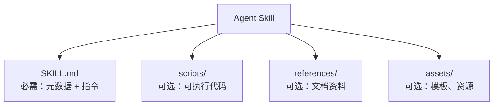
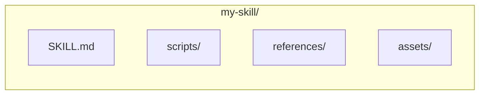
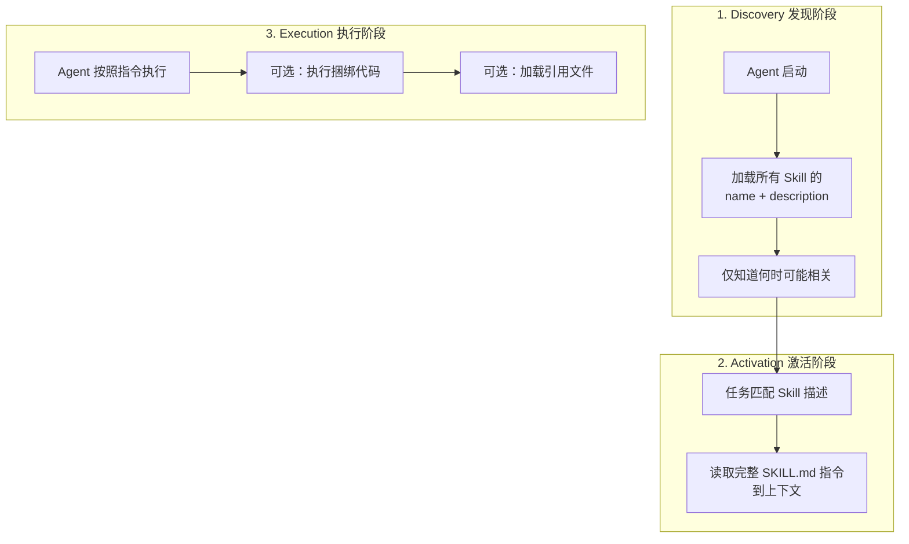
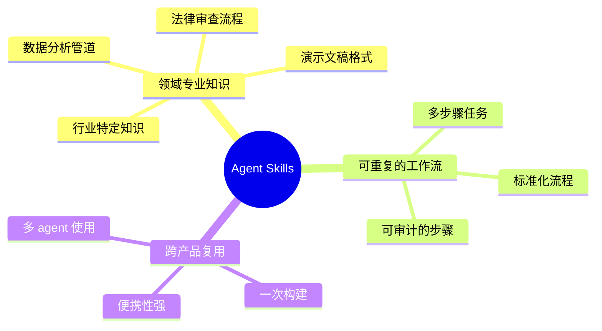
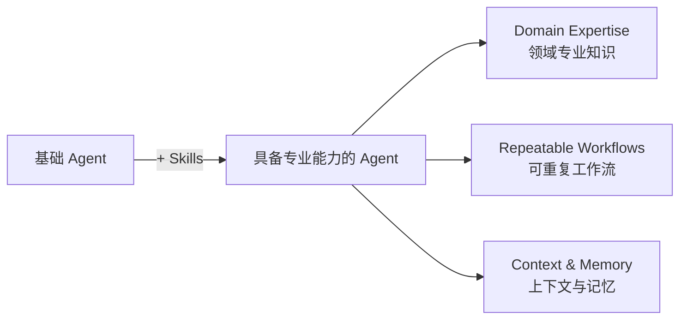
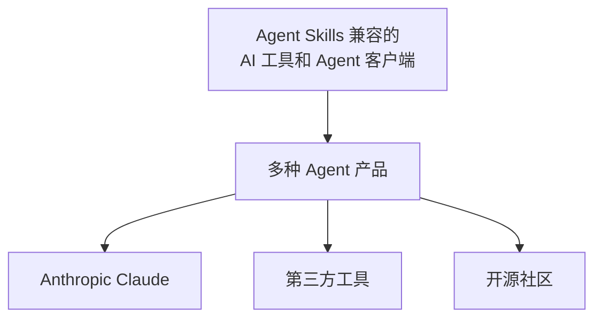
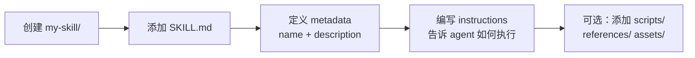

# Agent Skills 介绍

## 什么是 Agent Skills？

**Agent Skills** 是一个轻量级、开放的格式，用于为 AI Agent 扩展专业能力和工作流程。

## 核心结构



## 核心概念

### Skill 文件夹结构



## 工作原理 - 三阶段渐进式披露



## Agent Skills 解决的问题



## Agent 的能力增强



## 支持的工具



## 快速开始



## 关键特性

| 特性 | 说明 |
|------|------|
| **轻量级** | 只需一个 SKILL.md 文件即可开始 |
| **开放标准** | 由 Anthropic 开发，开放贡献 |
| **便携** | 版本控制的文件夹，易于分享 |
| **按需加载** | 仅在需要时加载完整指令，最小化上下文占用 |
| **社区支持** | Discord 社区 + 多种客户端支持 |

## SKILL.md 示例结构

```markdown
---
name: legal-review
description: Review legal documents for compliance issues
---

# Legal Review Skill

## When to use
- User asks to review a contract
- Document analysis requests

## How to perform legal review
1. Read the document
2. Identify key clauses
3. Flag potential issues
4. Provide recommendations
```